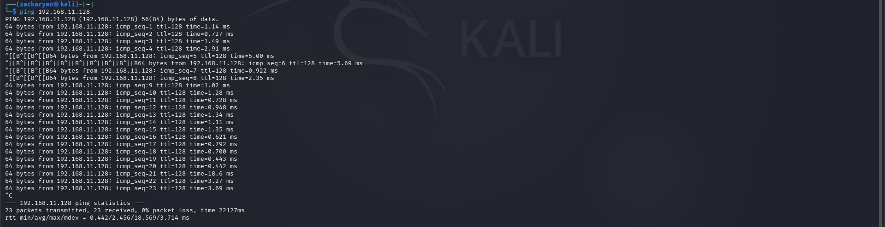
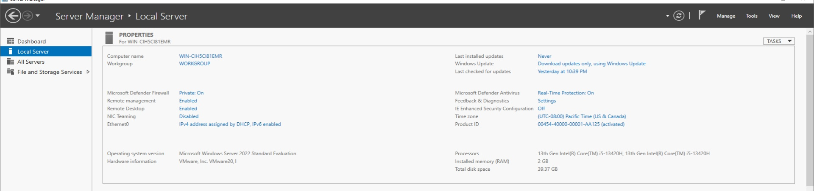

# Investigation Notes

> This file will be updated after completing the practical investigation.

# Step 0 – Lab Setup and Connectivity Verification

## Objective

Verify that the attacker machine (Kali Linux) and the target machine (Windows Server 2022) are properly connected over the VMware virtual network before performing the brute force attack simulation.

---

## Background

Before any authentication testing, it is important to verify that both virtual machines can communicate with each other. Proper network connectivity ensures that Windows Security logs and Splunk Enterprise can accurately capture authentication events generated during the investigation.

This step validates the lab environment and confirms that Remote Desktop Protocol (RDP) is available for authentication testing.

---

## Lab Environment

| Component | Description |
|-----------|-------------|
| Hypervisor | VMware Workstation |
| Attacker Machine | Kali Linux |
| Target Machine | Windows Server 2022 |
| SIEM | Splunk Enterprise |
| Log Source | Windows Security Event Logs |
| Network Mode | NAT |

---

## Tasks Performed

- Verified that Kali Linux and Windows Server 2022 were connected to the same VMware NAT network.
- Confirmed IP connectivity using the **ping** command.
- Enabled Remote Desktop (RDP) on Windows Server 2022.
- Verified that TCP Port **3389** was in the **LISTENING** state.
- Confirmed that the lab environment was ready for authentication testing.

---

## Observations

- VMware networking was configured successfully.
- Kali Linux successfully communicated with Windows Server 2022.
- Windows Server responded to ICMP (Ping) requests.
- Remote Desktop service was enabled successfully.
- TCP Port 3389 was listening for incoming RDP connections.
- The environment was ready for brute force authentication simulation.

---

# Evidence

## Screenshot 00 – Kali Linux Connectivity Verification

**Filename**


```text
00_Kali_RDP_Connectivity.jpg
```

**Description**

Kali Linux successfully communicating with Windows Server 2022 using network connectivity verification (Ping).

---

## Screenshot 01 – Remote Desktop Enabled

**Filename**

```text
01_Remote_Desktop_Enabled.jpg
```

**Description**

Windows Server 2022 showing Remote Desktop enabled for incoming RDP connections.

---

## Screenshot 02 – RDP Service Listening

**Filename**

```text
02_RDP_Port_3389_LISTENING.jpg
```

**Description**

Command Prompt displaying TCP Port 3389 in the LISTENING state, confirming that the Remote Desktop service is active.

---

## Commands Used

### Windows Server

```cmd
ipconfig
```

```cmd
netstat -an | find "3389"
```

### Kali Linux

```bash
ping <Windows_Server_IP>
```

---

## Result

The attacker machine (Kali Linux) and the target machine (Windows Server 2022) were successfully connected over the VMware NAT network. Remote Desktop was enabled and verified, confirming that the environment was fully prepared for the brute force authentication simulation.

---

## Status

✅ Completed
# Step 1 – Failed Login Simulation

## Objective

Simulate multiple failed Windows login attempts and verify that Windows Security Event ID **4625** is generated and successfully collected by Splunk Enterprise.

---

## Background

A brute force attack involves repeatedly attempting different passwords to gain unauthorized access to a user account. Windows records every failed authentication attempt as **Security Event ID 4625**.

In this lab, a **safe simulation** is performed by intentionally entering incorrect credentials through Remote Desktop Protocol (RDP). No password cracking tools or malicious software are used.

---

## Lab Components

| Component | Description |
|-----------|-------------|
| Attacker Machine | Kali Linux |
| Target Machine | Windows Server 2022 |
| SIEM | Splunk Enterprise |
| Event ID | 4625 (Failed Logon) |

---

## Tasks Performed

- Established an RDP connection from Kali Linux to Windows Server 2022.
- Entered an incorrect password **5–10 times** for the Administrator account.
- Verified that Windows Security generated **Event ID 4625**.
- Confirmed that Splunk Enterprise successfully indexed the failed authentication events.

---

## Observations

- Multiple failed login attempts were generated successfully.
- Windows Security recorded Event ID **4625** for each failed authentication attempt.
- Splunk Enterprise successfully received and indexed the authentication logs.
- The generated events can be used to identify brute force attack activity.

---

# Evidence

## Screenshot 03 – RDP Login Attempt from Kali Linux

**Filename**

```text
03_RDP_Login_Attempt_From_Kali.jpg
```

**Description**

Kali Linux initiating a Remote Desktop connection to Windows Server 2022 for authentication testing.

---

## Screenshot 04 – Failed Login Message

**Filename**

```text
04_Failed_Login_Message.jpg
```

**Description**

Windows Server displaying an authentication failure after an incorrect password was entered.

---

## Screenshot 05 – Event ID 4625 in Event Viewer

**Filename**

```text
05_EventID4625_EventViewer.jpg
```

**Description**

Windows Security Event Viewer displaying Event ID 4625 generated during the failed login attempts.

---

## Screenshot 06 – Event ID 4625 in Splunk

**Filename**

```text
06_EventID4625_in_Splunk.jpg
```

**Description**

Splunk Enterprise displaying Windows Security Event ID 4625 collected from Windows Server 2022.

---

## SPL Query

```spl
index=main EventCode=4625
```

If your Windows Security logs are stored in another index:

```spl
index=soc_lab EventCode=4625
```

---

## Result

The failed authentication attempts successfully generated Windows Security Event ID 4625. Splunk Enterprise collected and indexed the events, confirming that the SIEM environment can detect brute force login attempts.

---

## Status
✅ Completed

# Step 2 – Successful Login Verification

## Objective

Verify that a successful Windows authentication is recorded after multiple failed login attempts and that Windows Security **Event ID 4624** is successfully collected by Splunk Enterprise.

---

## Background

Following repeated failed authentication attempts, a successful login generates **Windows Security Event ID 4624**. This event confirms that a user has successfully authenticated and helps security analysts correlate successful logins with previous failed login attempts during a brute force investigation.

This step demonstrates that Splunk Enterprise can monitor both failed and successful authentication events within the Windows Security logs.

---

## Lab Components

| Component | Description |
|-----------|-------------|
| Hypervisor | VMware Workstation |
| Attacker Machine | Kali Linux |
| Target Machine | Windows Server 2022 |
| SIEM | Splunk Enterprise |
| Log Source | Windows Security Event Logs |
| Event ID | 4624 (Successful Logon) |

---

## Tasks Performed

- Logged in to Windows Server 2022 using the correct Administrator credentials.
- Verified that Windows Security generated **Event ID 4624**.
- Confirmed that Splunk Enterprise successfully collected and indexed the successful authentication event.
- Verified that the authentication event was available for security investigation.

---

## Observations

- Successful authentication was completed.
- Windows Security generated **Event ID 4624**.
- Splunk Enterprise successfully indexed the authentication event.
- Successful logon activity can be correlated with previous failed login attempts during brute force investigations.

---

# Evidence

## Screenshot 07 – Successful Login on Windows Server

**Filename**

```text
07_Successful_Login_On_Windows_Server.jpg
```

**Description**

Windows Server 2022 desktop displayed after a successful Administrator login.

> 📸 **Place Screenshot Here**

---

## Screenshot 08 – Event ID 4624 in Event Viewer

**Filename**

```text
08_EventID4624_EventViewer.jpg
```

**Description**

Windows Security Event Viewer displaying **Event ID 4624 (Successful Logon)** generated after successful authentication.

> 📸 **Place Screenshot Here**

---

## Screenshot 09 – Event ID 4624 in Splunk

**Filename**

```text
09_EventID4624_in_Splunk.jpg
```

**Description**

Splunk Enterprise displaying Windows Security **Event ID 4624** collected from Windows Server 2022.

> 📸 **Place Screenshot Here**

---

# SPL Query

If Windows Security logs are stored in the **main** index:

```spl
index=main EventCode=4624
```

If Windows Security logs are stored in another index:

```spl
index=soc_lab EventCode=4624
```

---

# Result

The successful authentication generated **Windows Security Event ID 4624**, and Splunk Enterprise successfully collected and indexed the event. This confirms that the SIEM environment can detect legitimate authentication events and correlate them with previous failed login attempts.

---

# Status

✅ Completed
# Step 3 – Brute Force Investigation

## Objective

Investigate multiple failed authentication attempts using Splunk Enterprise to identify brute force attack indicators and analyze authentication patterns.

---

## Background

Brute force attacks generate multiple failed authentication events within a short period of time. Windows records these events as **Security Event ID 4625**, while successful authentication is recorded as **Event ID 4624**.

By analyzing these logs in Splunk Enterprise, security analysts can identify suspicious login behavior, affected accounts, timestamps, and authentication trends.

---

## Lab Components

| Component | Description |
|-----------|-------------|
| SIEM | Splunk Enterprise |
| Log Source | Windows Security Logs |
| Event IDs | 4625 (Failed Logon), 4624 (Successful Logon) |
| Target | Windows Server 2022 |

---

## Tasks Performed

- Searched for failed authentication events (Event ID 4625).
- Counted the number of failed login attempts.
- Identified affected user accounts.
- Reviewed authentication timestamps.
- Verified successful authentication (Event ID 4624).
- Compared failed and successful authentication events.

---

## Observations

- Multiple failed authentication attempts were detected.
- Event ID 4625 appeared several times before successful authentication.
- Event ID 4624 confirmed a successful login.
- Authentication logs clearly demonstrated brute force attack behavior.
- Splunk Enterprise successfully collected all authentication events.

---

# Evidence

## Screenshot 10 – Multiple Failed Login Events

**Filename**

```text
10_Multiple_Failed_Login_Events.jpg
```

**Description**

Splunk Enterprise displaying multiple Windows Security Event ID 4625 events generated during the failed login simulation.

> 📸 Place Screenshot Here

---

## Screenshot 11 – Failed Login Statistics

**Filename**

```text
11_Failed_Login_Statistics.jpg
```

**Description**

Splunk statistics showing the number of failed login attempts for each user account.

> 📸 Place Screenshot Here

---

## Screenshot 12 – Authentication Timeline

**Filename**

```text
12_Authentication_Timeline.jpg
```

**Description**

Splunk displaying authentication events in chronological order for investigation.

> 📸 Place Screenshot Here

---

# SPL Queries

### Failed Login Events

```spl
index=main EventCode=4625
```

---

### Failed Login Statistics

```spl
index=main EventCode=4625
| stats count by Account_Name
```

---

### Authentication Timeline

```spl
index=main (EventCode=4624 OR EventCode=4625)
| sort _time
| table _time Account_Name EventCode host
```

---

## Result

The investigation successfully identified repeated failed authentication attempts followed by a successful login. Splunk Enterprise enabled efficient analysis of authentication logs, allowing the identification of suspicious login behavior and supporting brute force attack detection.

---

## Status

✅ Completed
# Step 4 – IOC (Indicators of Compromise) Extraction

## Objective

Extract Indicators of Compromise (IOCs) from the collected Windows Security authentication events and identify valuable forensic information for incident investigation.

---

## Background

Indicators of Compromise (IOCs) are pieces of evidence that help security analysts identify suspicious or malicious activity. During a brute force attack investigation, authentication logs provide important information such as usernames, hostnames, timestamps, source IP addresses, logon types, and event IDs.

This step demonstrates how Splunk Enterprise can be used to extract and analyze authentication-related IOCs from Windows Security Event Logs.

---

## Lab Components

| Component | Description |
|-----------|-------------|
| SIEM | Splunk Enterprise |
| Log Source | Windows Security Event Logs |
| Event IDs | 4624, 4625 |
| Investigation | IOC Extraction |

---

## Tasks Performed

- Searched Windows authentication events.
- Extracted authentication-related IOCs.
- Identified affected user accounts.
- Reviewed timestamps.
- Verified source host information.
- Collected authentication details for further investigation.

---

## IOC Information Collected

- Host Name
- User Account
- Event ID
- Logon Type
- Source Network Address (if available)
- Timestamp

---

# Evidence

## Screenshot 13 – IOC Extraction Query

**Filename**

```text
13_IOC_Extraction_Query.jpg
```

**Description**

Splunk search query used to extract authentication-related Indicators of Compromise (IOCs).

> 📸 Place Screenshot Here

---

## Screenshot 14 – IOC Information Table

**Filename**

```text
14_IOC_Information_Table.jpg
```

**Description**

Splunk table displaying extracted IOC information including host, username, event ID, logon type, source IP address, and timestamp.

> 📸 Place Screenshot Here

---

## Screenshot 15 – Authentication Event Details

**Filename**

```text
15_Authentication_Event_Details.jpg
```

**Description**

Detailed view of a Windows Security authentication event showing important IOC fields collected during the investigation.

> 📸 Place Screenshot Here

---

# SPL Queries

### IOC Extraction

```spl
index=main (EventCode=4624 OR EventCode=4625)
| table _time host Account_Name Source_Network_Address Logon_Type EventCode
```

---

### Authentication Details

```spl
index=main (EventCode=4624 OR EventCode=4625)
```

Click any authentication event to review the detailed event fields.

---

## Result

Authentication-related Indicators of Compromise (IOCs) were successfully extracted from Windows Security logs. Splunk Enterprise provided valuable forensic information including usernames, hostnames, timestamps, authentication status, and source information, enabling effective brute force attack investigation.

---

## Status

✅ Completed
# Step 5 – Incident Timeline Analysis

## Objective

Create a chronological timeline of the simulated brute force attack using Windows Security Event Logs collected in Splunk Enterprise.

---

## Background

An incident timeline helps security analysts understand the sequence of events during an attack. By arranging authentication events in chronological order, investigators can identify when failed login attempts occurred, when a successful login happened, and how the incident progressed.

This timeline provides valuable context for incident response and forensic analysis.

---

## Lab Components

| Component | Description |
|-----------|-------------|
| SIEM | Splunk Enterprise |
| Log Source | Windows Security Event Logs |
| Event IDs | 4625 (Failed Logon), 4624 (Successful Logon) |
| Investigation | Incident Timeline |

---

## Tasks Performed

- Reviewed failed authentication events (Event ID 4625).
- Reviewed successful authentication events (Event ID 4624).
- Sorted authentication events by timestamp.
- Built a chronological incident timeline.
- Verified the complete authentication sequence.

---

## Incident Timeline

| Time | Activity | Event ID |
|------|----------|----------|
| HH:MM | Failed Login Attempt #1 | 4625 |
| HH:MM | Failed Login Attempt #2 | 4625 |
| HH:MM | Failed Login Attempt #3 | 4625 |
| HH:MM | Failed Login Attempt #4 | 4625 |
| HH:MM | Failed Login Attempt #5 | 4625 |
| HH:MM | Successful Login | 4624 |
| HH:MM | Splunk Investigation Started | N/A |

> **Note:** Replace **HH:MM** with the actual timestamps collected from your Splunk logs.

---

# Evidence

## Screenshot 16 – Authentication Timeline Query

**Filename**

```text
16_Authentication_Timeline_Query.jpg
```

**Description**

Splunk search query displaying failed and successful authentication events in chronological order.

> 📸 Place Screenshot Here

---

## Screenshot 17 – Incident Timeline Results

**Filename**

```text
17_Incident_Timeline_Results.jpg
```

**Description**

Splunk Enterprise displaying the authentication timeline used during the brute force investigation.

> 📸 Place Screenshot Here

---

# SPL Query

```spl
index=main (EventCode=4624 OR EventCode=4625)
| sort _time
| table _time Account_Name EventCode host
```

If using another index:

```spl
index=soc_lab (EventCode=4624 OR EventCode=4625)
| sort _time
| table _time Account_Name EventCode host
```

---

## Result

The incident timeline successfully reconstructed the authentication sequence by arranging failed and successful login events in chronological order. The timeline clearly demonstrated repeated failed login attempts followed by a successful authentication, providing valuable context for the brute force investigation.

---

## Status

✅ Completed
# Step 6 – MITRE ATT&CK Mapping

## Objective

Map the observed brute force authentication activity to the MITRE ATT&CK framework to classify attacker behavior using industry-standard techniques.

---

## Background

MITRE ATT&CK is a globally recognized knowledge base of adversary tactics and techniques. Security analysts use this framework to classify attack behavior, improve threat detection, and support incident response activities.

During this lab, repeated failed authentication attempts followed by a successful login were observed. These activities correspond to the Credential Access tactic within the MITRE ATT&CK framework.

---

## Lab Components

| Component | Description |
|-----------|-------------|
| Framework | MITRE ATT&CK |
| Tactic | Credential Access |
| Technique | T1110.001 – Password Guessing |
| Data Source | Windows Security Event Logs |
| SIEM | Splunk Enterprise |

---

## Tasks Performed

- Reviewed Windows Security authentication events.
- Identified repeated failed login attempts.
- Correlated failed and successful authentication events.
- Mapped the observed activity to the MITRE ATT&CK framework.
- Documented the corresponding tactic and technique.

---

## MITRE ATT&CK Mapping

| Observed Activity | Event ID | MITRE Tactic | Technique ID | Technique |
|------------------|---------:|--------------|--------------|-----------|
| Multiple Failed Login Attempts | 4625 | Credential Access | T1110.001 | Password Guessing |
| Successful Login After Failed Attempts | 4624 | Credential Access | T1110 | Brute Force (related authentication activity) |

> **Note:** In this lab, the activity is a **safe authentication simulation** performed for defensive learning and log analysis.

---

# Evidence

## Screenshot 18 – MITRE ATT&CK Mapping

**Filename**

```text
18_MITRE_ATTACK_Mapping.jpg
```

**Description**

Documentation showing how the observed Windows authentication events were mapped to the MITRE ATT&CK framework.

> 📸 Place Screenshot Here

---

## Screenshot 19 – Authentication Events Supporting MITRE Mapping

**Filename**

```text
19_Authentication_Events_For_MITRE.jpg
```

**Description**

Splunk Enterprise displaying authentication events that support the MITRE ATT&CK mapping.

> 📸 Place Screenshot Here

---

# Supporting SPL Query

```spl
index=main (EventCode=4624 OR EventCode=4625)
| table _time Account_Name EventCode host
```

If using another index:

```spl
index=soc_lab (EventCode=4624 OR EventCode=4625)
| table _time Account_Name EventCode host
```

---

## Result

The authentication events were successfully mapped to the MITRE ATT&CK framework. The repeated failed login attempts aligned with the Credential Access tactic and Password Guessing (T1110.001) technique, demonstrating how Windows Security logs and Splunk Enterprise can be used to identify brute force attack behavior.

---

## Status

✅ Completed
