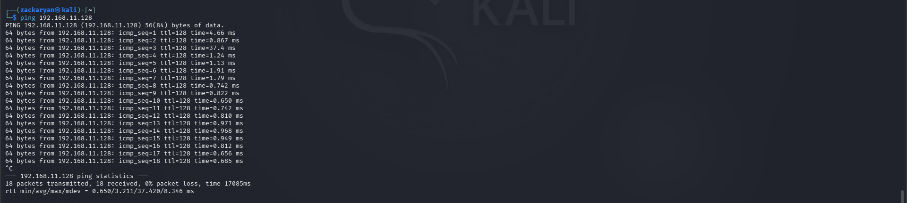
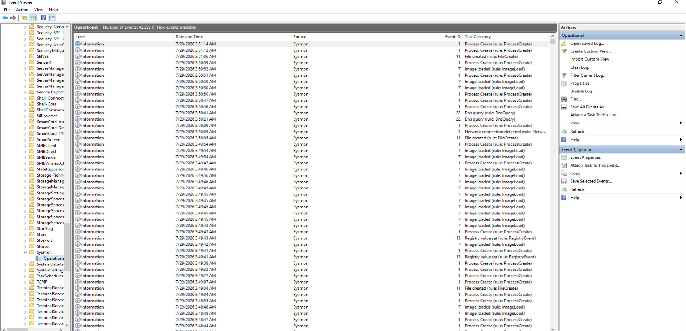
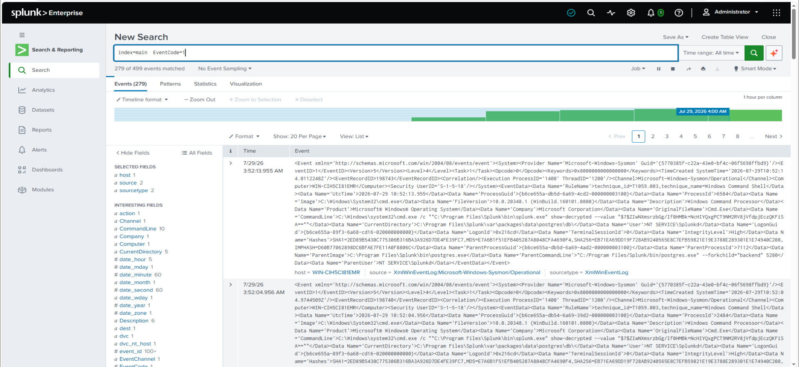
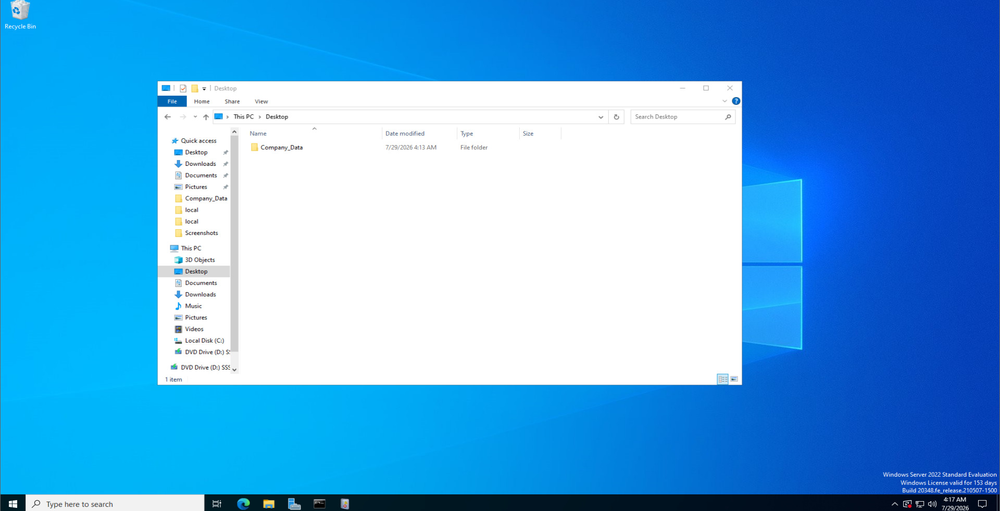
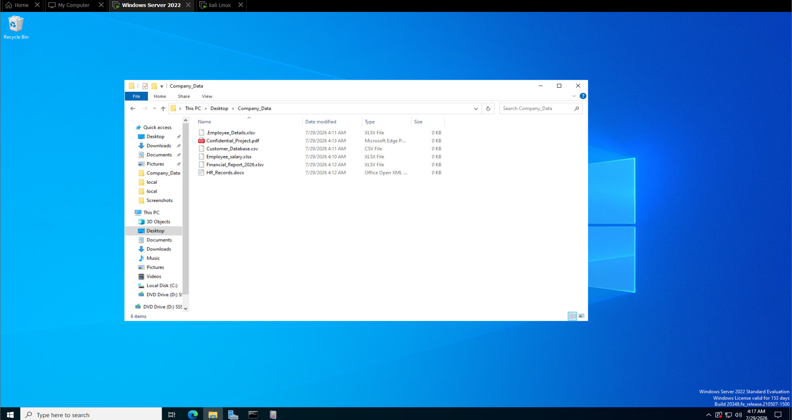

# DATA EXFILTRATION
## Investigation Notes

# Step 0 – Lab Setup

## Objective

Prepare the cybersecurity lab environment for a safe Data Exfiltration Detection and Investigation simulation using Microsoft Sysmon and Splunk Enterprise.

---

## Background

Before beginning the investigation, all lab components must be verified to ensure proper communication and log collection.

The objective of this step is to confirm that Windows Server 2022, Kali Linux, Microsoft Sysmon, and Splunk Enterprise are functioning correctly and ready for the data exfiltration simulation.

No malicious activity is performed during this stage.

---

## Lab Environment

| Component | Version |
|-----------|----------|
| Hypervisor | VMware Workstation |
| Operating System | Windows Server 2022 |
| Attacker Machine | Kali Linux 2026.1 |
| SIEM | Splunk Enterprise |
| Endpoint Monitoring | Microsoft Sysmon |

---

## Tasks Performed

- Started Windows Server 2022 virtual machine.
- Started Kali Linux virtual machine.
- Verified both systems were connected to the same VMware NAT network.
- Confirmed successful connectivity using ICMP (ping).
- Verified Microsoft Sysmon service was running.
- Confirmed Splunk Enterprise was receiving Windows Sysmon events.

---

# Evidence

## Screenshot 00 – Lab Connectivity Verification

**Filename**

```text
00_Lab_Connectivity.jpg
```

**Description**

Shows successful network connectivity between Kali Linux and Windows Server 2022 using the ping command.

> 📸 Place Screenshot Here

---

## Screenshot 01 – Microsoft Sysmon Verification

**Filename**

```text
01_Sysmon_Service.jpg
```

**Description**

Shows Microsoft Sysmon service running successfully on Windows Server 2022.

> 📸 Place Screenshot Here

---

## Screenshot 02 – Splunk Log Collection Verification

**Filename**

```text
02_Splunk_Receiving_Logs.jpg
```

**Description**

Shows Splunk Enterprise successfully receiving Windows Sysmon events.

> 📸 Place Screenshot Here

---

# Commands Used

### Kali Linux

```bash
ping <Windows_Server_IP>
```

Example

```bash
ping 192.168.xxx.xxx
```

---

### Windows Server

```cmd
hostname
```

```cmd
ipconfig
```

---

### Splunk Search

```spl
index=main EventCode=1
```

or

```spl
index=soc_lab
```

---

## Observations

- Windows Server and Kali Linux communicated successfully.
- Microsoft Sysmon was actively monitoring endpoint events.
- Splunk Enterprise successfully collected Sysmon logs.
- The lab environment was ready for the Data Exfiltration simulation.

---

## Result

The lab environment was successfully configured for the Data Exfiltration Detection project. All systems were operational, endpoint monitoring was enabled, and Splunk Enterprise was successfully receiving Windows Sysmon events.

---

## Status

✅ Completed

# Step 1 – Sensitive Company Data Creation

## Objective

Create a set of simulated confidential company files that will be used during the Data Exfiltration Detection investigation.

---

## Background

One of the earliest stages of a data exfiltration attack involves identifying and collecting valuable organizational data such as employee records, financial reports, customer databases, and confidential documents.

In this lab, a safe simulation is performed by creating dummy files that represent sensitive company information. No real confidential data is used.

---

## Tasks Performed

- Created a folder named **Company_Data**.
- Generated multiple dummy confidential files.
- Stored all files inside the Company_Data folder.
- Verified the files were successfully created.
- Prepared the environment for the next stage of the investigation.

---

# Folder Location

```text
C:\Company_Data
```

---

# Sample Files Created

```text
Employee_Salary.xlsx
Employee_Details.xlsx
Customer_Database.csv
Financial_Report_2026.xlsx
HR_Records.docx
Confidential_Project.pdf
```

---

## Observations

- The Company_Data folder was created successfully.
- Six dummy confidential files were generated.
- The files simulate sensitive organizational information.
- These files will be used during the simulated data collection phase.

---

# Evidence

## Screenshot 03 – Company Data Folder

**Filename**

```text
03_Company_Data_Folder.jpg
```

**Description**

Shows the Company_Data folder created successfully on Windows Server.

> 📸 Place Screenshot Here

---

## Screenshot 04 – Confidential Files

**Filename**

```text
04_Confidential_Files.jpg
```

**Description**

Displays all simulated confidential company files inside the Company_Data folder.

> 📸 Place Screenshot Here

---

## Result

The simulated confidential company data was successfully created and prepared for the Data Exfiltration Detection investigation.

---

## Status

✅ Completed

