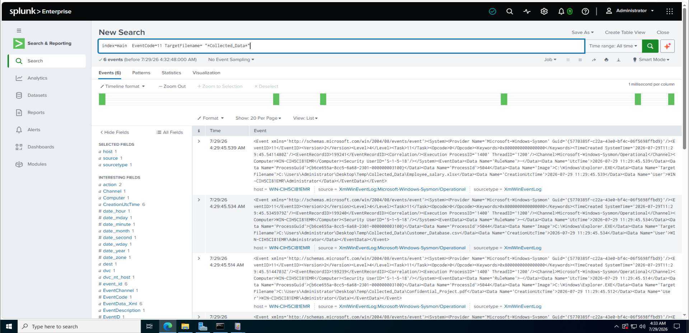
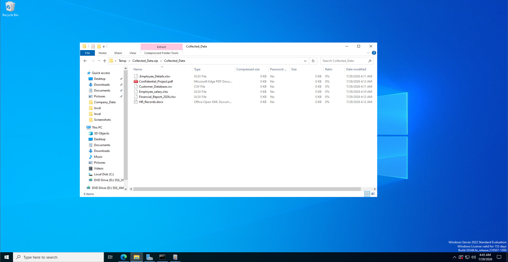
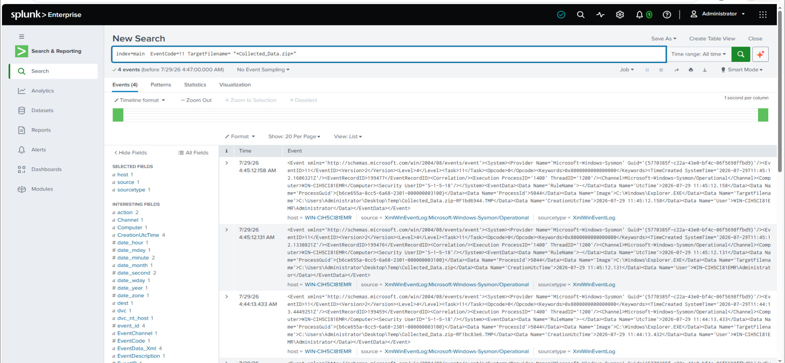

# DATA EXFILTRATION
## Investigation Notes

# Step 0 – Lab Setup

## Objective

Prepare the cybersecurity lab environment for a safe Data Exfiltration Detection and Investigation simulation using Microsoft Sysmon and Splunk Enterprise.

---

## Background

Before beginning the investigation, all lab components must be verified to ensure proper communication and log collection.

The objective of this step is to confirm that Windows Server 2022, Kali Linux, Microsoft Sysmon, and Splunk Enterprise are functioning correctly and ready for the data exfiltration simulation.

No malicious activity is performed during this stage.

---

## Lab Environment

| Component | Version |
|-----------|----------|
| Hypervisor | VMware Workstation |
| Operating System | Windows Server 2022 |
| Attacker Machine | Kali Linux 2026.1 |
| SIEM | Splunk Enterprise |
| Endpoint Monitoring | Microsoft Sysmon |

---

## Tasks Performed

- Started Windows Server 2022 virtual machine.
- Started Kali Linux virtual machine.
- Verified both systems were connected to the same VMware NAT network.
- Confirmed successful connectivity using ICMP (ping).
- Verified Microsoft Sysmon service was running.
- Confirmed Splunk Enterprise was receiving Windows Sysmon events.

---

# Evidence

## Screenshot 00 – Lab Connectivity Verification

**Filename**

```text
00_Lab_Connectivity.jpg
```

**Description**

Shows successful network connectivity between Kali Linux and Windows Server 2022 using the ping command.

> 📸 Place Screenshot Here

---

## Screenshot 01 – Microsoft Sysmon Verification

**Filename**

```text
01_Sysmon_Service.jpg
```

**Description**

Shows Microsoft Sysmon service running successfully on Windows Server 2022.

> 📸 Place Screenshot Here

---

## Screenshot 02 – Splunk Log Collection Verification

**Filename**

```text
02_Splunk_Receiving_Logs.jpg
```

**Description**

Shows Splunk Enterprise successfully receiving Windows Sysmon events.

> 📸 Place Screenshot Here

---

# Commands Used

### Kali Linux

```bash
ping <Windows_Server_IP>
```

Example

```bash
ping 192.168.xxx.xxx
```

---

### Windows Server

```cmd
hostname
```

```cmd
ipconfig
```

---

### Splunk Search

```spl
index=main EventCode=1
```

or

```spl
index=soc_lab
```

---

## Observations

- Windows Server and Kali Linux communicated successfully.
- Microsoft Sysmon was actively monitoring endpoint events.
- Splunk Enterprise successfully collected Sysmon logs.
- The lab environment was ready for the Data Exfiltration simulation.

---

## Result

The lab environment was successfully configured for the Data Exfiltration Detection project. All systems were operational, endpoint monitoring was enabled, and Splunk Enterprise was successfully receiving Windows Sysmon events.

---

## Status

✅ Completed

# Step 1 – Sensitive Company Data Creation

## Objective

Create a set of simulated confidential company files that will be used during the Data Exfiltration Detection investigation.

---

## Background

One of the earliest stages of a data exfiltration attack involves identifying and collecting valuable organizational data such as employee records, financial reports, customer databases, and confidential documents.

In this lab, a safe simulation is performed by creating dummy files that represent sensitive company information. No real confidential data is used.

---

## Tasks Performed

- Created a folder named **Company_Data**.
- Generated multiple dummy confidential files.
- Stored all files inside the Company_Data folder.
- Verified the files were successfully created.
- Prepared the environment for the next stage of the investigation.

---

# Folder Location

```text
C:\Company_Data
```

---

# Sample Files Created

```text
Employee_Salary.xlsx
Employee_Details.xlsx
Customer_Database.csv
Financial_Report_2026.xlsx
HR_Records.docx
Confidential_Project.pdf
```

---

## Observations

- The Company_Data folder was created successfully.
- Six dummy confidential files were generated.
- The files simulate sensitive organizational information.
- These files will be used during the simulated data collection phase.

---

# Evidence

## Screenshot 03 – Company Data Folder

**Filename**

```text
03_Company_Data_Folder.jpg
```

**Description**

Shows the Company_Data folder created successfully on Windows Server.

> 📸 Place Screenshot Here

---

## Screenshot 04 – Confidential Files

**Filename**

```text
04_Confidential_Files.jpg
```

**Description**

Displays all simulated confidential company files inside the Company_Data folder.

> 📸 Place Screenshot Here

---

## Result

The simulated confidential company data was successfully created and prepared for the Data Exfiltration Detection investigation.

---

## Status

✅ Completed

# Step 2 – Data Collection (Data Staging)

## Objective

Simulate the collection of sensitive company files into a temporary staging folder and verify that Microsoft Sysmon records the associated file activity.

---

## Background

Before exfiltrating data, attackers commonly collect important files into a temporary location. This process is known as **Data Staging**.

By staging files in one directory, attackers can easily compress, archive, or prepare them for transfer.

In this lab, a safe simulation is performed by copying dummy confidential files into a temporary folder. No files leave the Windows Server and no actual data exfiltration occurs.

---

## Tasks Performed

- Created a temporary folder named **Collected_Data**.
- Copied all simulated confidential files from **Company_Data**.
- Stored the copied files inside the Collected_Data folder.
- Verified that Microsoft Sysmon generated File Create events.
- Confirmed that Splunk Enterprise successfully collected the generated logs.

---

## Source Folder

```text
C:\Company_Data
```

## Destination Folder

```text
C:\Temp\Collected_Data
```

---

## Files Copied

```text
Employee_Salary.xlsx
Employee_Details.xlsx
Customer_Database.csv
Financial_Report_2026.xlsx
HR_Records.docx
Confidential_Project.pdf
```

---

## Observations

- The Collected_Data folder was created successfully.
- All dummy confidential files were copied successfully.
- Microsoft Sysmon generated File Create (Event ID 11) events.
- Splunk Enterprise successfully indexed the generated file activity.
- The activity simulates the data staging phase commonly observed before data exfiltration.

---

# Evidence

## Screenshot 05 – Data Collection Folder

**Filename**

```text
05_Data_Collection_Folder.jpg
```

**Description**

Shows the Collected_Data folder containing the copied confidential files.

> 📸 Place Screenshot Here

---

## Screenshot 06 – File Activity Detection in Splunk

**Filename**

```text
06_File_Activity_Detection_Splunk.jpg
```

**Description**

Shows Microsoft Sysmon File Create (Event ID 11) events generated during the file copy operation.

> 📸 Place Screenshot Here

---

## SPL Query

```spl
index=soc_lab EventCode=11
```

Alternative

```spl
index=main EventCode=11
```

---

## Result

The confidential files were successfully collected into a temporary staging folder. Microsoft Sysmon detected the file creation activity, and Splunk Enterprise successfully indexed the generated events. This demonstrates how defenders can identify data staging activity before a potential data exfiltration attempt.

---

## Status

✅ Completed

# Step 3 – Archive Creation (Data Staging)

## Objective

Simulate an attacker preparing collected files for exfiltration by compressing them into a ZIP archive and verify that Microsoft Sysmon records the file creation activity.

---

## Background

Before data is transferred outside an organization, attackers often compress multiple files into a single archive. This reduces file size, keeps related documents together, and makes data transfer easier.

In this lab, a safe simulation is performed by creating a ZIP archive containing dummy company files. No data is transmitted outside the lab environment.

---

## Tasks Performed

- Opened the **Collected_Data** folder.
- Selected all collected dummy files.
- Created a ZIP archive named **Collected_Data.zip**.
- Verified that the ZIP file was created successfully.
- Confirmed that Microsoft Sysmon generated file creation events.
- Verified that Splunk Enterprise collected the generated logs.

---

## Archive Location

```text
C:\Temp\Collected_Data\Collected_Data.zip
```

---

## Observations

- The ZIP archive was successfully created.
- Microsoft Sysmon detected the archive creation activity.
- Splunk Enterprise successfully indexed the generated events.
- Archive creation represents the data staging phase before exfiltration.

---

# Evidence

## Screenshot 06 – ZIP Archive Created

**Filename**

```text
06_ZIP_Archive_Created.jpg
```

**Description**

Shows the Collected_Data.zip archive successfully created inside the Collected_Data folder.

> 📸 Place Screenshot Here

---

## Screenshot 07 – ZIP File Detection in Splunk

**Filename**

```text
07_ZIP_File_Detection_Splunk.jpg
```

**Description**

Shows Microsoft Sysmon Event ID 11 related to the ZIP archive creation.

> 📸 Place Screenshot Here

---

## SPL Query

### Process Creation

```spl
index=soc_lab EventCode=1
```

### File Creation

```spl
index=soc_lab EventCode=11
```

### Archive Investigation

```spl
index=soc_lab TargetFilename="*Collected_Data.zip*"
```
```spl
index=soc_lab EventCode=11
```

Alternative

```spl
index=main EventCode=11
```

---

## Result

The ZIP archive was successfully created and Microsoft Sysmon recorded the associated file creation activity. Splunk Enterprise successfully indexed the event, demonstrating how data staging activities can be monitored before a potential data exfiltration attempt.

---

## Status

✅ Completed
# Step 4 – Threat Assessment & Investigation Findings

## Objective

Analyze the collected evidence and determine whether the observed activity indicates a potential data exfiltration attempt.

---

## Background

After collecting endpoint logs and reviewing file activity, security analysts assess the overall incident to determine the severity of the activity, identify suspicious behavior, and decide whether incident response actions are required.

This step focuses on analyzing the evidence gathered during the previous stages rather than generating new events.

---

## Tasks Performed

- Reviewed all collected evidence from the previous steps.
- Correlated Process Creation and File Create events.
- Verified that confidential files were collected into a staging folder.
- Confirmed the creation of the ZIP archive.
- Assessed the overall attack sequence.
- Determined the potential security impact.

---

## Investigation Findings

The investigation identified a sequence of activities commonly associated with the preparation phase of a data exfiltration attack.

The observed activity included:

- Creation of confidential company files.
- Collection of files into a temporary staging folder.
- Creation of a ZIP archive containing the staged files.
- Microsoft Sysmon successfully recorded the related events.
- Splunk Enterprise successfully indexed the generated logs.

Although no files were transferred outside the system, the observed behavior closely resembles the preparation stage commonly seen before data exfiltration attempts.

---

## Security Assessment

| Observation | Status |
|-------------|--------|
| Sensitive files identified | ✅ |
| Data staging detected | ✅ |
| Archive creation detected | ✅ |
| Endpoint monitoring successful | ✅ |
| Splunk log collection successful | ✅ |
| Actual data transfer detected | ❌ |

---

## Risk Assessment

**Risk Level:** Medium

The activity represents suspicious behavior because multiple confidential files were collected and archived. While no external transfer occurred during this lab, similar behavior in a production environment should trigger a security investigation.

---

## Evidence

This analysis is based on the evidence collected in the previous steps.

No additional screenshots are required.

---

## Result

The simulated investigation successfully demonstrated how Microsoft Sysmon and Splunk Enterprise can identify suspicious data staging activities before an actual data exfiltration attempt occurs.

---

## Status

✅ Completed

# Step 5 – IOC Extraction

## Objective

Extract Indicators of Compromise (IOCs) from the Microsoft Sysmon events collected by Splunk Enterprise during the simulated data staging investigation.

---

## Background

Indicators of Compromise (IOCs) are forensic artifacts that help security analysts identify suspicious activities and reconstruct attacker behavior.

During this investigation, Sysmon logs are analyzed to extract key information related to the simulated data staging activity.

---

## Tasks Performed

- Extracted Host Name.
- Identified the User Account.
- Recorded Process Name.
- Identified Target File Names.
- Collected Event IDs.
- Recorded Event Timestamp.
- Reviewed the generated IOC table.

---

## IOC Information

| IOC | Value |
|------|-------|
| Host Name | Windows Server Host |
| User | Administrator |
| Process Name | explorer.exe |
| Event ID | 1, 11 |
| Target File | Collected_Data.zip |
| Timestamp | Splunk Event Time |

---

# Evidence

## Screenshot 12 – IOC Extraction Query

Filename

```text
12_IOC_Extraction_Query.jpg
```

> 📸 Place Screenshot Here

---

## Screenshot 13 – IOC Table

Filename

```text
13_IOC_Table.jpg
```

> 📸 Place Screenshot Here

---

## SPL Query

```spl
index=soc_lab (EventCode=1 OR EventCode=11)
| table _time host User Image TargetFilename EventCode
```

---

## Result

The Indicators of Compromise were successfully extracted from Microsoft Sysmon logs and verified using Splunk Enterprise.

---

## Status

✅ Completed
# Step 6 – Incident Timeline & MITRE ATT&CK Mapping

## Objective

Create a timeline of the simulated attacker activity and map the observed behavior to the MITRE ATT&CK framework.

---

## Incident Timeline

| Time | Activity |
|------|----------|
| HH:MM | Company_Data folder created |
| HH:MM | Sensitive files created |
| HH:MM | Files copied to Collected_Data |
| HH:MM | ZIP archive created |
| HH:MM | Sysmon detected activity |
| HH:MM | Splunk investigation performed |

Replace **HH:MM** with the actual timestamps from your Splunk logs.

---

## MITRE ATT&CK Mapping

| Activity | Technique ID | Technique |
|----------|--------------|-----------|
| Local Data Collection | T1005 | Data from Local System |
| Data Staging | T1074 | Data Staged |
| Archive Collected Data | T1560.001 | Archive via Utility |

---

# Evidence

## Screenshot 14 – Incident Timeline

Filename

```text
14_Incident_Timeline.jpg
```

> 📸 Place Screenshot Here

---

## Screenshot 15 – MITRE ATT&CK Mapping

Filename

```text
15_MITRE_ATTACK_Mapping.jpg
```

> 📸 Place Screenshot Here

---

## Result

The observed activities were successfully reconstructed into a chronological timeline and mapped to the MITRE ATT&CK framework.

---

## Status

✅ Completed
# Step 7 – Incident Response Summary

## Objective

Summarize the incident using the NIST Incident Response Lifecycle.

---

## Detection

Microsoft Sysmon detected process execution and file creation activities associated with the simulated data staging operation. Splunk Enterprise successfully collected and indexed the generated events.

---

## Analysis

The investigation confirmed that multiple confidential files were collected into a temporary staging folder and compressed into a ZIP archive. No external transfer of data occurred during the simulation.

---

## Containment

- Review the affected endpoint.
- Monitor suspicious file collection activities.
- Restrict unauthorized access to confidential directories.
- Alert the SOC team for further investigation.

---

## Eradication

- Remove unauthorized staged files.
- Delete unnecessary archive files.
- Verify endpoint integrity.
- Review user permissions.

---

## Recovery

- Restore normal access to business data.
- Continue monitoring Sysmon events.
- Validate endpoint security controls.

---

## Lessons Learned

- Microsoft Sysmon provides valuable endpoint visibility.
- Splunk Enterprise enables effective investigation of suspicious file activities.
- Monitoring file staging and archive creation can help identify potential data exfiltration attempts before data leaves the organization.

---

# Evidence

## Screenshot 16 – Incident Response Summary

Filename

```text
16_Incident_Response_Summary.jpg
```

> 📸 Place Screenshot Here

---

## Conclusion

The simulated Data Exfiltration Detection project successfully demonstrated how Microsoft Sysmon and Splunk Enterprise can detect, investigate, and analyze suspicious file collection and archive creation activities in a controlled cybersecurity lab environment. Although no actual data exfiltration occurred, the generated logs provided realistic evidence for incident investigation and SOC analyst training.

---

## Status

✅ Project Completed
