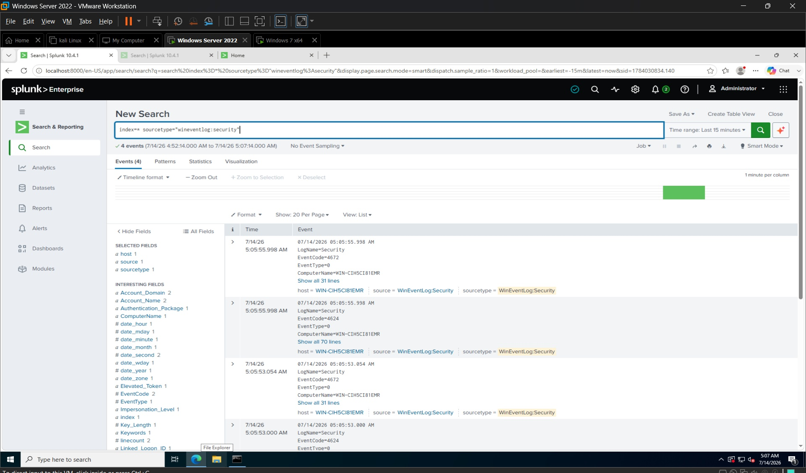
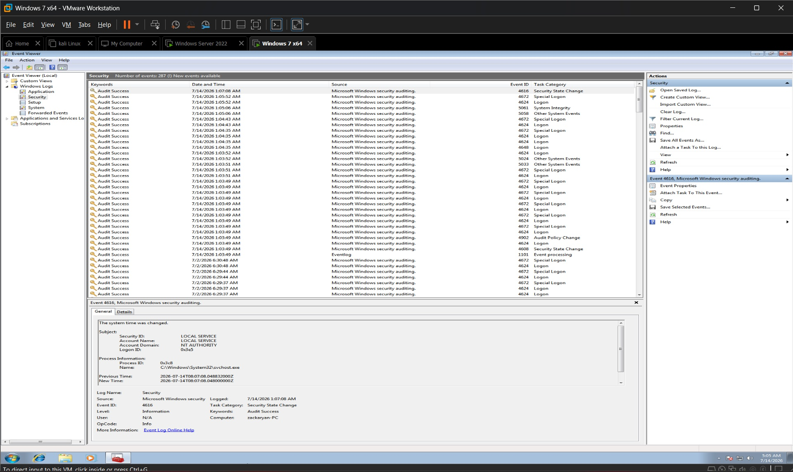
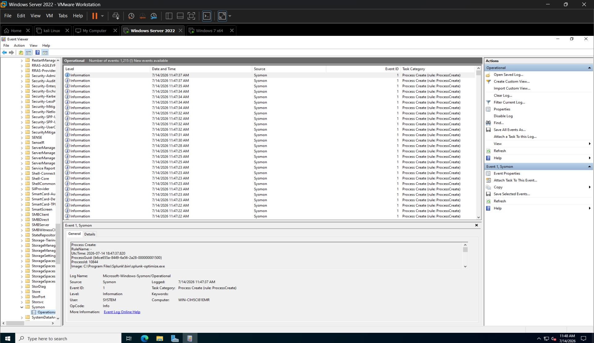

# Investigation Report
# Investigation Notes

## Step 1 – Log Verification

### Objective
Verify that Windows Security Event Logs are being collected by Splunk.

### Observations
- Windows 7 Security Event Logs were successfully generated.
- Splunk received Windows Security logs successfully.
- Communication between Windows 7 and Splunk is working correctly.

### Evidence
- Screenshot 01: Splunk Security Logs
- Screenshot 02: Windows Event Viewer Security Logs
## Additional Evidence
- Screenshot 03 – Sysmon Download and Extract
- Screenshot 04 – Investigation Notes  

### Status
✅ Completed
---

## Evidence Screenshots

### Screenshot 01 - Splunk Security Logs
**Observation:**
- Splunk successfully received Windows Security Event Logs.
- Security events were indexed correctly without errors.

**Description:** Splunk successfully collected Windows Security Event Logs.

---

### Screenshot 02 - Windows Event Viewer Security Logs
**Observation:**
- Windows Security Event Viewer displayed successful log generation.
- Login and security events were available for analysis.

**Description:** Windows Event Viewer displaying Security logs generated during testing.

---

### Screenshot 03 - Sysmon Download and Extract
**Observation:**
- Sysmon package was successfully downloaded and extracted.
- The extracted files were ready for installation and endpoint monitoring configuration.

**Description:** Sysmon downloaded and extracted for endpoint monitoring configuration.

---

### Screenshot 04 - Investigation Notes
**Observation:**
- Investigation findings were documented successfully.
- Log verification confirmed that Windows Security logs were collected by Splunk.
- The evidence was reviewed and the investigation step was marked as completed.

**Description:** Final investigation notes documenting log verification and observations.
---

## Step 2 – Sysmon Verification

**Date:** (Today's Date)

### Objective
Verify that Sysmon is installed successfully and generating endpoint monitoring events.

### Observations
- Sysmon was installed successfully on the Windows Server.
- Sysmon Operational logs were visible in Event Viewer.
- Endpoint monitoring was functioning correctly.
- Sysmon is ready to generate detailed security events for further investigation.

### Evidence
- Screenshot 05: Sysmon Operational Log

### Status
✅ Completed

---

## Evidence Screenshots

### Screenshot 05 – Sysmon Operational Log

**Description:**
This screenshot confirms that Sysmon is successfully installed and actively generating operational events in Windows Event Viewer.

