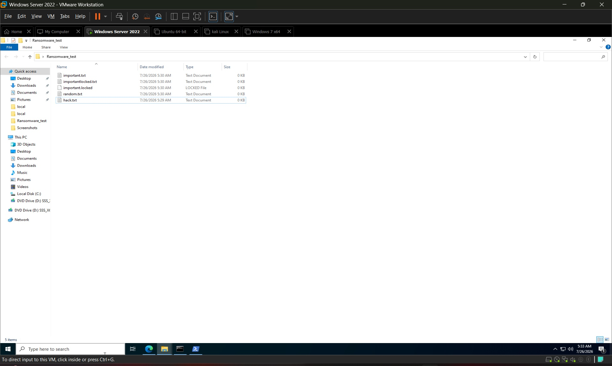
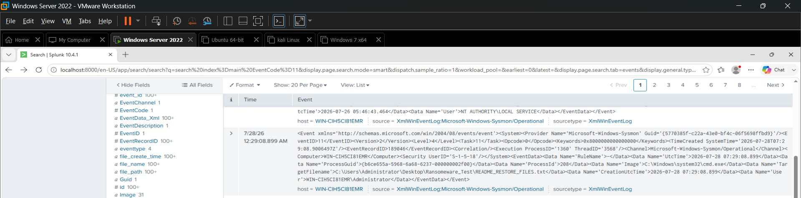
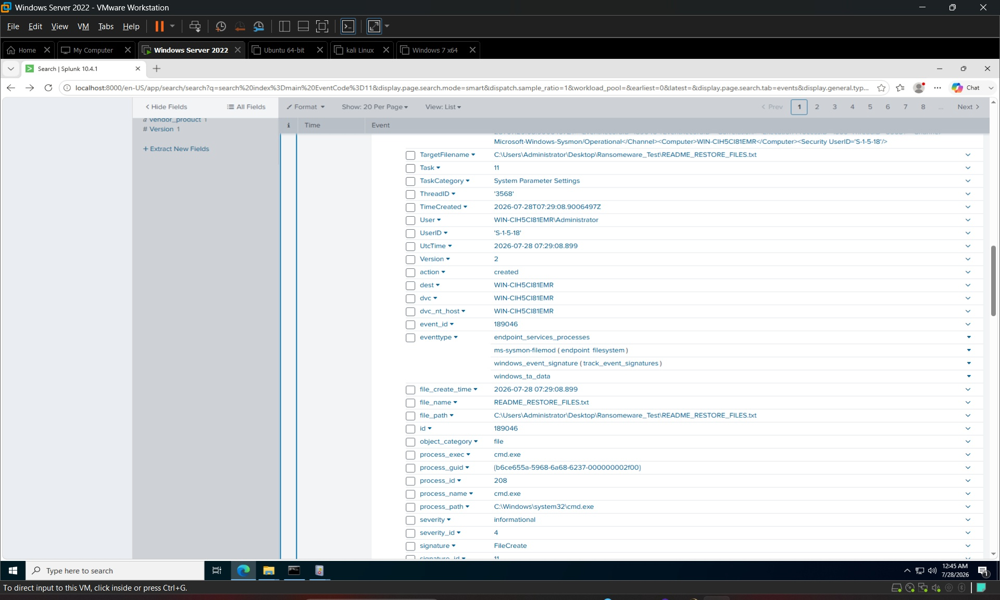

# Investigation Report
# Investigation Notes

## Step 1 – Log Verification

### Objective
Verify that Windows Security Event Logs are being collected by Splunk.

### Observations
- Windows 7 Security Event Logs were successfully generated.
- Splunk received Windows Security logs successfully.
- Communication between Windows 7 and Splunk is working correctly.

### Evidence
- Screenshot 01: Splunk Security Logs
- Screenshot 02: Windows Event Viewer Security Logs
## Additional Evidence
- Screenshot 03 – Sysmon Download and Extract
- Screenshot 04 – sysmon Operational logs  

### Status
✅ Completed
---

## Evidence Screenshots

### Screenshot 01 - Splunk Security Logs
**Observation:**
- Splunk successfully received Windows Security Event Logs.
- Security events were indexed correctly without errors.


**Description:** Splunk successfully collected Windows Security Event Logs.

---

### Screenshot 02 - Windows Event Viewer Security Logs
**Observation:**
- Windows Security Event Viewer displayed successful log generation.
- Login and security events were available for analysis.


**Description:** Windows Event Viewer displaying Security logs generated during testing.

---

### Screenshot 03 - Sysmon Download and Extract
**Observation:**
- Sysmon package was successfully downloaded and extracted.
- The extracted files were ready for installation and endpoint monitoring configuration.


**Description:** Sysmon downloaded and extracted for endpoint monitoring configuration.

---

### Screenshot 04 - Investigation Notes
**Observation:**
- Investigation findings were documented successfully.
- Log verification confirmed that Windows Security logs were collected by Splunk.
- The evidence was reviewed and the investigation step was marked as completed.


**Description:** Final investigation notes documenting log verification and observations.
---
## Step 2 – Verify that Microsoft Sysmon is successfully installed and that Sysmon Operational logs are collected by Splunk Enterprise.

**Date:** (Today's Date)

### Objective
Verify that Microsoft Sysmon is successfully installed and configured on Windows Server 2022 for advanced endpoint monitoring and security event collection.

### Observations
- Microsoft Sysmon was successfully installed.
- Sysmon Operational logs were generated successfully.
- Splunk successfully received Sysmon Operational logs.
### Evidence
- Screenshot 05 – Sysmon Logs in Splunk

Observation:
• Sysmon Operational events were successfully indexed in Splunk.
• Splunk is receiving endpoint telemetry from Microsoft Sysmon.

Description:
Splunk Enterprise displaying Sysmon Operational events collected from Windows Server 2022.
- 

### Status
✅ Completed


**Description:**
This screenshot confirms that Sysmon Operational events were successfully collected and indexed in Splunk Enterprise.
### Conclusion

Windows Security Event Logs and Microsoft Sysmon Operational Logs were successfully collected and indexed in Splunk Enterprise. The logging pipeline was verified, confirming that the environment is ready for further incident response and ransomware detection activities.

# Step 3 – Suspicious Process Activity Simulation

## Objective

Simulate suspicious process activity on Windows Server 2022 and verify that Microsoft Sysmon captures the events in Splunk Enterprise.

---

## Tasks Performed

- Opened Command Prompt (cmd.exe)
- Opened Windows PowerShell
- Executed basic Windows commands:
  - whoami
  - ipconfig
  - tasklist
- Verified that Microsoft Sysmon generated Process Creation events (Event ID 1).
- Confirmed that Splunk Enterprise successfully indexed the generated events.

---

## Observations

- Sysmon successfully monitored process execution.
- Process Creation events were generated.
- Splunk successfully received and indexed the Sysmon events.
- The activity can be used for security monitoring and incident investigation.

---

## Evidence

**Screenshot 06 – Suspicious Process Activity**

**Screenshot 07 – Process Creation Events in Splunk**

**Status**

✅ Completed

---

## Screenshot 06


**Description**

Windows Server 2022 showing Command Prompt and PowerShell executing test commands to generate Sysmon events.

---

## Screenshot 07

**Description**

Splunk Enterprise displaying Sysmon Process Creation (Event ID 1) events generated during the activity simulation.

---

## SPL Query Used

```spl
index=main EventCode=1
```

---

## Result

The simulated process activity was successfully detected by Microsoft Sysmon and indexed in Splunk Enterprise, confirming that endpoint monitoring is functioning correctly.
## Step 4 – File Activity Simulation

### Objective
Simulate ransomware-like file activity on Windows Server 2022 and verify that Microsoft Sysmon captures the generated events in Splunk Enterprise.

### Tasks Performed
- Created a test folder (`C:\Ransomware_Test`)
- Created multiple test files
- Modified and renamed files
- Deleted a test file
- Verified Sysmon File Activity events in Splunk

### Observations
- File activity events were generated successfully.
- Microsoft Sysmon monitored file operations.
- Splunk Enterprise successfully indexed the generated events.
- The collected logs can be used for ransomware detection and investigation.

### Evidence

**Screenshot 08 – File Activity on Windows Server**


> Simulated file creation, modification, rename, and deletion inside the ransomware test folder.

**Screenshot 09 – File Activity in Splunk**


> Splunk Enterprise displaying Sysmon File Activity events generated during the simulation.

### SPL Query

```spl
index=main EventCode=11
```

> If additional events are available:

```spl
index=main (EventCode=11 OR EventCode=23 OR EventCode=26)
```

### Result

The simulated file activity was successfully detected by Microsoft Sysmon and indexed in Splunk Enterprise. This confirms that the monitoring environment is capable of detecting suspicious file operations commonly associated with ransomware behavior.

**Status:** ✅ Completed

# Step 5 – Simulated Ransom Note Creation

## Objective

Simulate the final stage of a ransomware attack by creating a ransom note and verify that Microsoft Sysmon detects the file creation activity in Splunk Enterprise.

---

## Background

Many ransomware families create a ransom note after encrypting files. The ransom note usually informs the victim that their files have been encrypted and provides payment instructions.

In this lab, a **safe ransomware simulation** was performed. **No real ransomware was executed and no files were encrypted or damaged.** The objective was to generate ransomware-like artifacts and verify that Microsoft Sysmon and Splunk Enterprise successfully detected them.

---

## Tasks Performed

- Created a folder named **Ransomware_Test** on the Windows Server 2022 Desktop.
- Created a simulated ransom note named **README_RESTORE_FILES.txt** inside the folder.
- Added a sample ransom message to imitate real ransomware behavior.
- Verified that Microsoft Sysmon generated a **File Create (Event ID 11)** event.
- Confirmed that Splunk Enterprise successfully indexed the generated event.
- Verified the captured event details:
  - Target Filename
  - File Name
  - Process Name
  - File Create Action
  - User Account
  - Timestamp

---
### Sample Ransom Note

```text
==============================
YOUR FILES HAVE BEEN ENCRYPTED
==============================

This is a safe ransomware simulation created for cybersecurity lab testing.

No files were actually encrypted or damaged.

Contact: attacker@example.com
```

## Sample Ransom Note

```text
==============================
YOUR FILES HAVE BEEN ENCRYPTED
==============================

This is a safe ransomware simulation created for cybersecurity lab testing.

No files were actually encrypted or damaged.

Contact: attacker@example.com
```

---

## Observations

- The simulated ransom note was successfully created.
- Microsoft Sysmon detected the **File Create (Event ID 11)** event.
- Splunk Enterprise successfully indexed the generated event.
- Event details confirmed:
  - File Name: **README_RESTORE_FILES.txt**
  - Process Name: **cmd.exe**
  - Action: **created**
  - Signature: **FileCreate**
- This demonstrates how defenders can identify ransomware indicators during security monitoring and incident response.

---

# Evidence

## Screenshot 10 – Simulated Ransom Note
.jpg)

Shows the **Ransomware_Test** folder containing **README_RESTORE_FILES.txt**. The ransom note is opened in Notepad displaying the simulated ransom message.

**Filename**

```
10_Simulated_Ransom_Note.jpg
```

---

## Screenshot 11 – Ransom Note Detection in Splunk

Displays the **Sysmon File Create (Event ID 11)** event in Splunk Enterprise confirming that the ransom note creation was successfully detected.

The event shows:

- Event ID: 11
- File Create Event
- Target Filename
- README_RESTORE_FILES.txt

**Filename**

```
11_Ransom_Note_Detection_in_Splunk.jpg
```

---

## Screenshot 12 – Event Details Verification



Shows the detailed Sysmon event collected by Splunk Enterprise.

The investigation confirms the following forensic information:

- TargetFilename
- README_RESTORE_FILES.txt
- File Name
- Process Name (cmd.exe)
- FileCreate Signature
- Action: created
- User Account
- Timestamp

This provides detailed evidence that the ransom note creation was successfully monitored by Microsoft Sysmon.

**Filename**

```
12_Ransom_Note_Event_Details.jpg
```

---

# SPL Query Used

```spl
index=main EventCode=11 README_RESTORE_FILES
```

### Alternative Query

```spl
index=main EventCode=11
```

---

# Detection Summary

| Field | Value |
|-------|-------|
| Event ID | 11 |
| Detection | File Create |
| File Name | README_RESTORE_FILES.txt |
| Process | cmd.exe |
| Action | created |
| Source | Microsoft Sysmon |
| SIEM | Splunk Enterprise |

---

# Result

The simulated ransom note was successfully detected by Microsoft Sysmon and indexed in Splunk Enterprise. The event captured important forensic information including the file name, target path, process name, timestamp, and user account.

This confirms that the monitoring environment is capable of detecting ransomware indicators such as ransom note creation and provides valuable evidence for incident response and threat investigation.

---

## Status

**✅ Completed**
# Step 6 – IOC Extraction

## Objective

Extract Indicators of Compromise (IOCs) generated during the ransomware simulation using Microsoft Sysmon logs collected in Splunk Enterprise.

---

## IOC Investigation

The Sysmon logs generated during the simulation were analyzed to identify indicators commonly used during incident response investigations.

The following information was extracted from the generated events.

| Indicator | Value |
|-----------|-------|
| Host Name | WIN-CIH5CI81EMR |
| User | Administrator |
| Process Name | notepad.exe |
| Parent Process | explorer.exe |
| File Name | README_RESTORE_FILES.txt |
| File Path | C:\Users\Administrator\Desktop\Ransomware_Test\README_RESTORE_FILES.txt |
| Event ID | 1 (Process Create), 11 (File Create) |
| Timestamp | 2026-07-28 07:29 UTC |

---

## SPL Query

```spl
index=main README_RESTORE_FILES
```

Alternative

```spl
index=main (EventCode=1 OR EventCode=11)
| table _time host User Image TargetFilename EventCode
```

---

## Observations

- Process Create (Event ID 1) recorded execution of Notepad.
- File Create (Event ID 11) detected creation of README_RESTORE_FILES.txt.
- Host, user, timestamp, process, and file path were successfully extracted.
- These indicators can be used during threat hunting and incident response investigations.

---

## Evidence

### Screenshot All - IOC Extraction

- Screenshot 12 – IOC Extraction Search Query
- Screenshot 13 – Process Create Event Details
- Screenshot 14 – File Create Event Details
- Screenshot 15 – IOC Information Fields
- Screenshot 16 – IOC Table View
- Screenshot 17 – README_RESTORE_FILES Search Result

---

## Result

The generated Sysmon events successfully provided valuable Indicators of Compromise (IOCs), including process execution details, file creation activity, user information, host name, timestamps, and file paths. These artifacts can assist security analysts in identifying ransomware behavior and performing incident investigations.

**Status:** ✅ Completed
# Step 7 – Incident Timeline Analysis

## Objective
Create a timeline of the simulated ransomware activity using Microsoft Sysmon events collected in Splunk Enterprise.

## Timeline of Events

| Time (Approx.) | Activity | Sysmon Event ID | Description |
|----------------|----------|-----------------|-------------|
| 12:20:22 AM | CMD Executed | Event ID 1 | Command Prompt launched to prepare the ransomware simulation. |
| 12:20:29 AM | Test Files Created | Event ID 11 | Sample files were created inside the Ransomware_Test folder. |
| 12:23:45 AM | Files Renamed | Event ID 11 | Test files were renamed with a simulated ransomware extension. |
| 12:29:08 AM | Ransom Note Created | Event ID 11 | README_RESTORE_FILES.txt was created in the Ransomware_Test folder. |
| 12:29:14 AM | Notepad Opened | Event ID 1 | README_RESTORE_FILES.txt was opened using Notepad.exe for verification. |
| 12:29:15 AM | Splunk Detection | Event ID 11 | Splunk successfully indexed the ransomware note creation event. |

## SPL Query

```spl
index=main README_RESTORE_FILES
```

or

```spl
index=main (EventCode=1 OR EventCode=11)
```

## Evidence

- Screenshot 16 – Incident Timeline Search
- Screenshot 17 – Timeline Events in Splunk

## Result

The collected Sysmon events clearly show the sequence of activities performed during the ransomware simulation. The timeline demonstrates how security analysts can reconstruct attacker behavior from process creation and file creation events.
# Step 8 – MITRE ATT&CK Mapping

## Objective

Map the observed ransomware simulation activities to the MITRE ATT&CK Framework.

## MITRE ATT&CK Mapping

| Observed Activity | MITRE Technique | Technique ID |
|-------------------|-----------------|--------------|
| Command Prompt Execution | Command and Scripting Interpreter: Windows Command Shell | T1059.003 |
| Notepad Execution | User Execution | T1204 |
| File Creation | Data Encrypted for Impact (Simulated) | T1486 |
| Ransom Note Creation | Data Encrypted for Impact (Simulation) | T1486 |
| File Rename Activity | Data Encrypted for Impact (Simulation) | T1486 |

## Explanation

Although no real malware or encryption was executed, the simulated behavior closely resembles the final stages of a ransomware attack. Microsoft Sysmon successfully captured process creation and file creation events, allowing Splunk Enterprise to detect activities commonly associated with ransomware operations.

## Evidence

- Screenshot 18 – Process Creation (Event ID 1)
- Screenshot 19 – File Creation (Event ID 11)
- Screenshot 20 – MITRE ATT&CK Related Events in Splunk

## Result

The observed events successfully map to multiple MITRE ATT&CK techniques commonly associated with ransomware. This demonstrates how defenders can use Sysmon and Splunk to identify attacker behavior and perform threat hunting based on MITRE ATT&CK.
