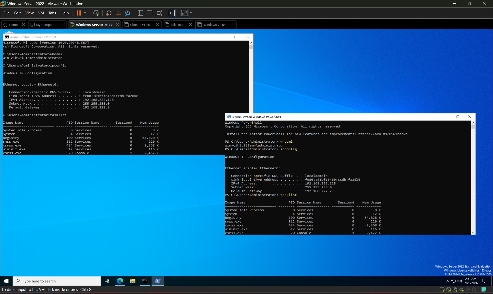
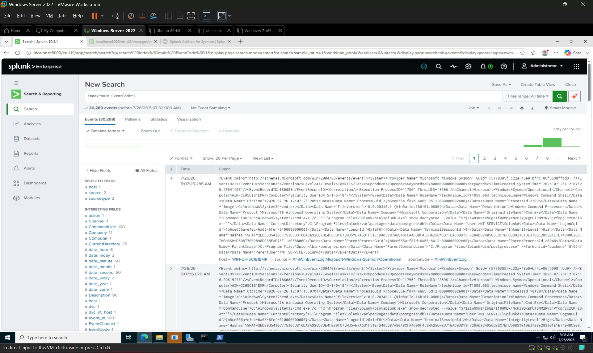
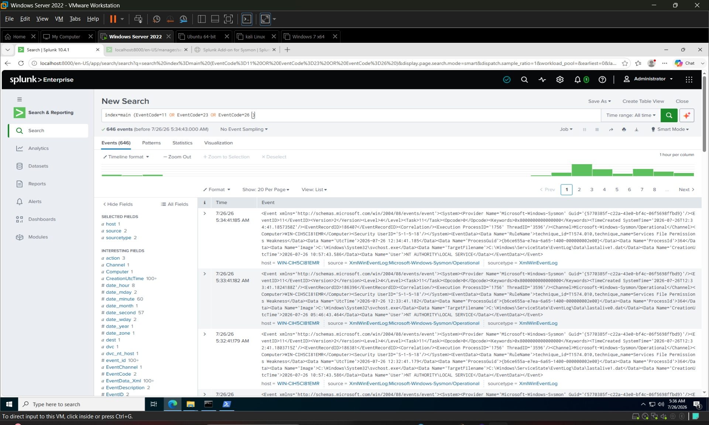

# Investigation Report
# Investigation Notes

## Step 1 – Log Verification

### Objective
Verify that Windows Security Event Logs are being collected by Splunk.

### Observations
- Windows 7 Security Event Logs were successfully generated.
- Splunk received Windows Security logs successfully.
- Communication between Windows 7 and Splunk is working correctly.

### Evidence
- Screenshot 01: Splunk Security Logs
- Screenshot 02: Windows Event Viewer Security Logs
## Additional Evidence
- Screenshot 03 – Sysmon Download and Extract
- Screenshot 04 – sysmon Operational logs  

### Status
✅ Completed
---

## Evidence Screenshots

### Screenshot 01 - Splunk Security Logs
**Observation:**
- Splunk successfully received Windows Security Event Logs.
- Security events were indexed correctly without errors.


**Description:** Splunk successfully collected Windows Security Event Logs.

---

### Screenshot 02 - Windows Event Viewer Security Logs
**Observation:**
- Windows Security Event Viewer displayed successful log generation.
- Login and security events were available for analysis.


**Description:** Windows Event Viewer displaying Security logs generated during testing.

---

### Screenshot 03 - Sysmon Download and Extract
**Observation:**
- Sysmon package was successfully downloaded and extracted.
- The extracted files were ready for installation and endpoint monitoring configuration.


**Description:** Sysmon downloaded and extracted for endpoint monitoring configuration.

---

### Screenshot 04 - Investigation Notes
**Observation:**
- Investigation findings were documented successfully.
- Log verification confirmed that Windows Security logs were collected by Splunk.
- The evidence was reviewed and the investigation step was marked as completed.


**Description:** Final investigation notes documenting log verification and observations.
---
## Step 2 – Verify that Microsoft Sysmon is successfully installed and that Sysmon Operational logs are collected by Splunk Enterprise.

**Date:** (Today's Date)

### Objective
Verify that Microsoft Sysmon is successfully installed and configured on Windows Server 2022 for advanced endpoint monitoring and security event collection.

### Observations
- Microsoft Sysmon was successfully installed.
- Sysmon Operational logs were generated successfully.
- Splunk successfully received Sysmon Operational logs.
### Evidence
- Screenshot 05 – Sysmon Logs in Splunk

Observation:
• Sysmon Operational events were successfully indexed in Splunk.
• Splunk is receiving endpoint telemetry from Microsoft Sysmon.

Description:
Splunk Enterprise displaying Sysmon Operational events collected from Windows Server 2022.
- 

### Status
✅ Completed


**Description:**
This screenshot confirms that Sysmon Operational events were successfully collected and indexed in Splunk Enterprise.
### Conclusion

Windows Security Event Logs and Microsoft Sysmon Operational Logs were successfully collected and indexed in Splunk Enterprise. The logging pipeline was verified, confirming that the environment is ready for further incident response and ransomware detection activities.

# Step 3 – Suspicious Process Activity Simulation

## Objective

Simulate suspicious process activity on Windows Server 2022 and verify that Microsoft Sysmon captures the events in Splunk Enterprise.

---

## Tasks Performed

- Opened Command Prompt (cmd.exe)
- Opened Windows PowerShell
- Executed basic Windows commands:
  - whoami
  - ipconfig
  - tasklist
- Verified that Microsoft Sysmon generated Process Creation events (Event ID 1).
- Confirmed that Splunk Enterprise successfully indexed the generated events.

---

## Observations

- Sysmon successfully monitored process execution.
- Process Creation events were generated.
- Splunk successfully received and indexed the Sysmon events.
- The activity can be used for security monitoring and incident investigation.

---

## Evidence

**Screenshot 06 – Suspicious Process Activity**

**Screenshot 07 – Process Creation Events in Splunk**

**Status**

✅ Completed

---

## Screenshot 06


**Description**

Windows Server 2022 showing Command Prompt and PowerShell executing test commands to generate Sysmon events.

---

## Screenshot 07

**Description**

Splunk Enterprise displaying Sysmon Process Creation (Event ID 1) events generated during the activity simulation.

---

## SPL Query Used

```spl
index=main EventCode=1
```

---

## Result

The simulated process activity was successfully detected by Microsoft Sysmon and indexed in Splunk Enterprise, confirming that endpoint monitoring is functioning correctly.
## Step 4 – File Activity Simulation

### Objective
Simulate ransomware-like file activity on Windows Server 2022 and verify that Microsoft Sysmon captures the generated events in Splunk Enterprise.

### Tasks Performed
- Created a test folder (`C:\Ransomware_Test`)
- Created multiple test files
- Modified and renamed files
- Deleted a test file
- Verified Sysmon File Activity events in Splunk

### Observations
- File activity events were generated successfully.
- Microsoft Sysmon monitored file operations.
- Splunk Enterprise successfully indexed the generated events.
- The collected logs can be used for ransomware detection and investigation.

### Evidence

**Screenshot 08 – File Activity on Windows Server**

> Simulated file creation, modification, rename, and deletion inside the ransomware test folder.

**Screenshot 09 – File Activity in Splunk**



> Splunk Enterprise displaying Sysmon File Activity events generated during the simulation.

### SPL Query

```spl
index=main EventCode=11
```

> If additional events are available:

```spl
index=main (EventCode=11 OR EventCode=23 OR EventCode=26)
```

### Result

The simulated file activity was successfully detected by Microsoft Sysmon and indexed in Splunk Enterprise. This confirms that the monitoring environment is capable of detecting suspicious file operations commonly associated with ransomware behavior.

**Status:** ✅ Completed
